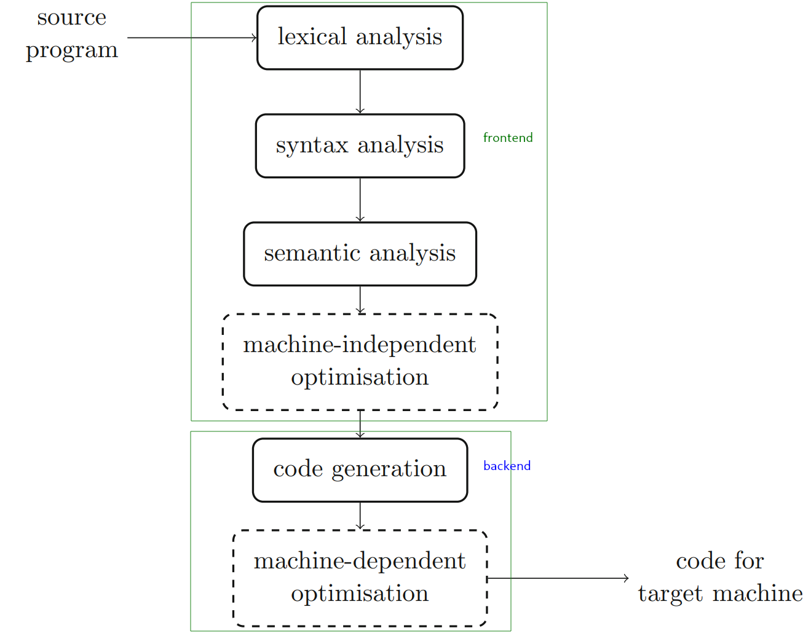
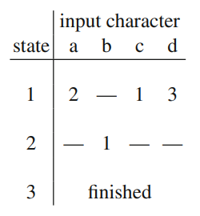
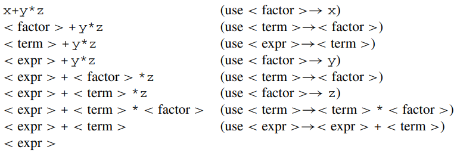
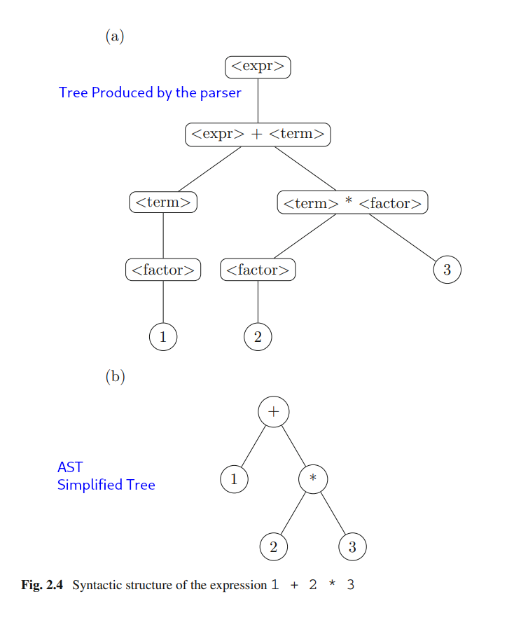

# What is a compiler?

A program which translates a program (source) from a higher level programming language into another language.

# Notes

## Chapter 1

### Why study compilers?
- Many of the design aspects of compilers have application to other fields, such as:
		- language interpretation
		- parsing techniques
		- transformation of one language into another
- We haven't really cracked a way to generate machine code which can full take advantage of parallel architectures
		- That is apparent in video games where most of them cannot take full advantage of parallelisation and thus load slower
- A look into and understaning of how processors work
- Opportunity to learn programming data structures and algorithms
- Understand why a programming language is designed the way it is
- ```"one of the best ways of learning a programming language is to write a compiler for that language, preferably writing it in its own language"```

### Machine code
- Is binary instructions
- Programmed by humans explicitly in the early days of computers

### Assembly code
- Replaced the development of machine code
- Set of short instructions which translate into machine code
- The translation from assembly to machine code is done by assemblers
- Assembler: a specialised program which translates assembly code into machine code

### The speed/efficiency of higher level programming languages
The speed or efficiency of a higher level programming language, lies in the compilation of source code into assembly and the generation of efficient machine code, by the assembler. If the assemlber produces unoptimized code, the program will execute slower.
That's why some programming language are slower than others.

### How compilers are simplified today?
- Additional tools have been developed which generate parts of the compiler
		- Lexical analysers and syntax analysers (two early stages of the compilation)
				- Are language specific
				- Take as input the source language specification
				- Produce an output for the compiler
				- Reduce compiler workload
- Compiler modularization into multiple tools and/or stages, helped reduce their complexity
- Some compilers features several parts: forntend and backend
		- Frontend:
				- generates an intermediate representation (IR) language
				- The frontend can be **machine independent**
		- Intermediate representation (IR) language
				- interface between frontend and backend
		- Backend
				- consumes IR and produces machine code
				- The backend can be **source language independent**
- Frontends and Backends can be mixed and matched (since they're independent from eachother)

### Interpreters
- All programming languages implementations are somewhat interpreted.
Tehere are 3 forms of interpretation:
		1. Source level interpretation:
				- on consecutive runs, the interpreter analyses the source program and translate each command into machine instruction and runs the instructions
				- low runtime efficiency
				- interpreter and source code in memory
		2. Intermediate code interpretation:
				- the analysis of the program is performed once and produces an intermediate form
				- on consecutive runs, the interpreter executes the intermediate form, which is faster
				- the intermediate form is a form of compilation
				- interpreter and intermediate form code in memory
		3. Target code interpretation:
				- full compilation
				- no need for an interpreter
				- on consecutive runs the hardware performs the commands directly since they're already compiled
				- initial compilation cost
				- only machine code in memory

## Chapter 2

### VM based programming languages
1. The **compiler**, generates code for a virtual machine
2. The **interpreter**, reads the virtual machine code and emulates the execution of the virtual machine, instruction by instruction

###  Programming language semantics
- Semantics assigns computational meaning to valid strings in a programming language syntax.
- Ref: https://en.wikipedia.org/wiki/Semantics_(computer_science)#:~:text=In%20programming%20language%20theory%2C%20semantics,program%20in%20that%20specific%20language.

### How are semantics defined
1. Attribute grammars (complex)
2. Reference implementation (error prone)
3. Specify semantics in a natural language (English) (common, easiest)

### Operators and Operands
- Operators: Mathematical symbols: +-*/
- Operands: Numbers/Variables: 1,2,x,y

### Operator associativity
- Defines how operations are executed without the presence of parenthesis in a mathematical expression
Examples: 1+2*3

### Metalanguages
- languages used to describe the syntax of other higher level langauge
- BNF (Backus Naur Form)
- EBNF (Extended BNF)

### BNF (Backus Naur Form)
```
<expr> ::= <term> | <expr> + <term> | <expr> - <term>
<term> ::= <factor> | <term> * <factor> | <term> / <factor>
<factor> ::= <integer> | (<expr>)
<integer> ::= <digit> | <integer> <digit>
<digit> ::= 0 | 1 | 2 | 3 | 4 | 5 | 6 | 7 | 8 | 9
```

### EBNF
- Extended BNF
- Has the following aditional symbols.

| Usage            | Notation                     |
|------------------|------------------------------|
| definition       | `=`                          |
| concatenation    | `,`                          |
| termination      | `;`                          |
| alternation      | `|`                         |
| optional         | `[ ... ]`                    |
| repetition       | `{ ... }` zero or more times |
| grouping         | `( ... )`                    |
| terminal string  | `" ... "`                    |
| terminal string  | `' ... '`                    |
| comment          | `(* ... *)`                  |
| special sequence | `? ... ?`                    |
| exception        | `-`                          |

- Ref: https://en.wikipedia.org/wiki/Extended_Backus%E2%80%93Naur_form#EBNF

### A valid programming language has
1. A defined syntax
		- is defined with the use of matalanguages
2. Defined semantics
		- defined by reference sheets

### Grammars
G = (N, T, S, P)
N: non-terminal symbols
T: terminal symbols
S: starting symbol
P: production rules (α → β)
U = N ∪ T (union of non-terminal and terminal symbols)


### Chomsky Hierarchy
- Defined hierarchical classification of formal grammars
- Which provides a framework for the defnition of programming languages
- And the analysis of programs writen in these languages
- Essentially: it defines productions in the form (x → y)
- 4 types
- Chomsky type 0: __free grammar__ or an __unrestricted grammar__
		- simple productions of the form α → β
		- no constraints
- Chomsky type 1: __context-sensitive grammar__
		- αAβ → αγβ
		where α, β, γ ∈ U∗
		γ is non-null
		A is a single non-terminal symbol
- Chomsky type 2: __context free grammar__
		- productions (A → γ) correspond directly to BNF
		- if a language can be defined in BNF
				- the language is no more complex than Chomsky type 2
		- "Programming languages are generally defined using type 2 grammars
		and these grammars are used directly in the production of code for program analysis."
- Chomsky type 3: __regular grammar__
		- Used in the lexical analysis in the compiler
		- Programs in these languges can be described by FSMs (Finite State Machines)
		- Grammar productions: A → a or A → a B
- Ref: https://en.wikipedia.org/wiki/Chomsky_hierarchy#The_hierarchy

### Parsing
- Is one of the key tasks performed by a compiler.
- Performs **Reduction steps**
		- Source program => BNF and check syntax correctness 
		- reverse process of going from BNF into valid program expressions
		- Much harder
		- Different reduction steps can lead to a non-starting symbol
				- Algorithms have been developed to tackle this issue.
- The parsing is successful when the transformation (program => BNF) ends with the starting symbol.

### Production vs Reduction processes
- Production: BNF => Source program
- Reduction: Source program => BNF (reverse process)

### Prasing strategies
1. Top-down (start with root)
2. Bottom-up (start with leaves)

### Phases of compilation
1. Lexical analysis
		- Group lexical tokens
		- Examples of lexical tokens: numbers, identifiers, punctuation, operators, strings, etc.
		- Chomsky type 3
		- OUTPUT: group of lexical tokens
2. Syntax analysis
		- INPUT: groups of lexical tokens
		- Perform reduction on the lexical token group and reduce them into BNF statements
		- If reduction fails, recover with message
		- Construct the program's syntax tree
		- Chomsky type 2
		- OUTPUT: Abstract Syntax Tree
3. Semantic analysis
		- INPUT: Abstract Syntax Tree
		- Traverses the tree and inserts the following:
				- types, operator overload, scopes, etc.
		- Flatten the parse tree to produce some form of intermediate code
		- OUTPUT: Intermediate Representation
4. Machine-independent optimization (optional)
		- Applies code optimization techniques on the intermediate code
				- I.E. Loop unrolling, Function expansion, etc.
5. Code generation
		- Depending on the target generates:
				- Hardware code (Machine)
				- or  Assembly code
				- or Virtual Machine code
6. Machine-dependent optimization (optional)
		- Optimizes generated machine code



## Chapter 3
- Examine 2 approaches to designing a lexical analyser.
		1. Direct implmementation.
				- Hand crafted lexical analyser (we write the code).
		2. Syntactic specification of lexical tokens (formal path).
				- Use regexes to identify lexical tokens.

### 1. Direct implementation

### Lexical analysis
- Break the program into a sequence of tokens.
- All the lexical tokens should be definable in terms of regular expressions Chomsky type 3.
- Nested structures cannot be expressed with regexes and are left for the next stage.
- Does not check for syntax correctness, i.e. "The syntax correctness of the while loop".
- In general, comments can be ignored.
- Some whitespeces cannot be ignored (int a; // Note space after 'a')
- Source line numbers can be included in the Output.
		- Easier to debug later in case of errors or warnings.
- INPUT: Source program
- Output: Lexical tokens

Example

```
// Input
while (i <= 100) {
tot += a[i]; /* form vector total */
i++;
}
```

```
// Output
while (reserved word), (, i (identifier), <=, 100 (integer constant), ), {, tot (identifier),
+=, a (identifier), [, i (identifier), ], ;, i (identifier), ++, ;, }
```

### Enum in C
- Special kind of data type defined by the user.
- Consists of constant integrals or integers that are given names by a user.
-  The use of enum in C to name the integer values makes the entire program easy to learn.
- Enum is derrived from the mathematical constant ingegration:
d/dx f(x) = f'(x)
∫f′(x).dx = g(x)+C
And g(x)+C = f(x).

So, the integration ∫f′(x).dx is equal to g(x) plus a constant 'C', which can be any random constant.

Example
```C
enum flag {const1, const2, ..., constN};
// By default const1=0, const2=1, ...
// OR, custom values
enum days {
		Monday = 1,
		Tuesday = 2,
		Wednesday = 3,
		Thursday = 4,
};
```
- Ref: https://www.cuemath.com/calculus/constant-of-integration/
- Ref: https://www.programiz.com/c-programming/c-enumeration

### typedef in C
- Used to give a type a new name.
- Or create an entirely new type, such as when using enum.
Example

```C
// Define a custom type named BYTE
typedef unsigned char BYTE;
// Use BYTE to create variables b1 and b2
BYTE b1, b2;

typedef enum {
		Monday,
		Tuesday,
		Wednesday,
		Thursday,
} days;

days day_of_week();
```
- Ref: https://www.tutorialspoint.com/cprogramming/c_typedef.htm

### Case statement in C

```C
switch (expression)
{
    case constant1:
      // statements
      break;

    case constant2:
      // statements
      break;
    .
    .
    .
    default:
      // default statements
}
```
- Ref: https://www.programiz.com/c-programming/c-switch-case-statement

### Maximun integer value in C
- Defined in `/usr/include/limits.h`
- `#  define INT_MAX   2147483647`
- `2^31-1`
 
### Sidenote on the lexical analyser
- Define a function lex().
		- Takes no arguments.
		- Returns a lextokens result.
```C
typedef enum {a,b,c,d} lextokens;
lextokens lex();
```

### Error handling by the lexical analyser
- Ideally, you want the lexical analyser to communication the errors it finds to the syntax analyser.
- Then the syntax analyser should know how to handle these errors.
- Until the communication (lexical analyser <=> syntax analyser) is established, the first one should print the errors to `stderr`.

### Testing (lexical analyser)
- The lexical analyser has to be sufficiently tested.
- Test are automated, a main program feeds the lexical analyser with code and expects the correct results back.
- Edge cases must be taken into account.
- Writing test for the lexical analyser can prevent later issues with syntax analyser.

---

### 2. Implementation via regexes (Tool based implementation)

### Regular expressions
- A regex is made up of symbols of the language + operators
- Operators:
		- concatenation: specified by symbol adjacency
		- alteration: specified with '|'
				- One or the other.
				- If succeded by *, then you can repeat symbols zero of multiple times
		- repetition: specified with '*'
				- applied to the left.
				- Zero or more repetitions.
		- Parenthesis: denote grouping of actions.
- Precedence:
		1. repetition
		2. concatenation
		2. alteration

```regex
• abc denotes the set of strings with the single member {abc}.
• a|b|c denotes the set {a, b, c}.
• a∗ denotes {ε, a, aa, aaa,...}. ε is the empty string.
• ab∗ denotes the infinite set {a, ab, abb, abbb,...}.
• (a|b)∗ denotes the set of strings made up of zero or more a’s or b’s.
• a(bc|d)∗e denotes the set of strings including {ae, abce, abcde, ade,...}.
```
- A specification in regex is not necessarily unique: a(b|c) == ab|ac

### Other regex symbolx
- `+`: 1 or more repetitions
- `.`: represents the wildcard character (match any single character)
- `?`: zero or one occurrence of the one-character regular expression(match as little as possible): https://stackoverflow.com/questions/8575281/regex-plus-vs-star-difference
- `\\`: to match a special character
- `^`: https://stackoverflow.com/questions/16944357/carets-in-regular-expressions
		- when at the start and inside `[]` means "not the following", so `[^...]`
		- when inside [] but not at the start, it means the actual ^ character
		- Examples:
				1. [^abc] 		 -> not a, b or c
				2. [ab^cd] 		 -> a, b, ^ (character), c or d
				3. \^ 			 -> ^ character
				4. Anywhere else -> **start** of string/line.
- `[ ]`: create a matching list that will match any of the characters in the list, so [abc] == any of a, b, or c
- `$`: matches only the ending of a line, so `o$` == only words ending in o
- `&`: ???
- Online regex tester: https://regexr.com/
- Ref: https://users.cs.cf.ac.uk/Dave.Marshall/Internet/NEWS/regexp.html
- Online regex exercises: https://regexone.com/lesson/capturing_groups

### Finite State Machines (Finite State Automata)
- Transition diagram.
		- Each node is called a state.
		- You have a starting state.
		- You have an ending/acceptable sate (double circles).
		- Edges are labeled.


- Transition tables can be used to describe machines as well.



- Deterministic finite-state machines
		- For each state there is there is at most one possible state for each input symbol.
		- "The entries in the transition table are either empty or contain a single next state."

- Non-Deterministic finite-state machines
		- An input symbol can trigger the machine into more than one next state simultaneously.
		- Multiple starting states.

### Lexical analyser implementation with regex
- Is a hard and time consuming process.
		- Simplify transition tables is hard.
- We use sofwrare which generates lexers by providing language specification.

### Lexical analyser constructor (tools) software
- Unix tool: lex (look man page || `info lex`)
		- Lesk ME (1975) Lex – a lexical analyser generator. AT&T Bell Laboratories, Murray Hill. Computing Science Technical Report 39
- Flex (look man page || `info flex`)
		- Levine J (2009) Flex & bison. O’Reilly Media, Sebastopol
- More out there...
- Easy to use and easy to generate lexers.
- Generate very efficient lexical analysers

### Flex
- Popular tool for generating lexers.
- INPUT:

```Flex
# file: lex.l
definitions
%%
rules
%%
user code
```
- OUTPUT (C program `lex.yy.c.`)
		- yylex()
				- Returns the next token and executes its code from the rules.
- Example
```Flex
letter			[a-zA-Z]
digit 			[0-9]
letter_or_digit [a-zA-Z0-9]
white_space 	[ \t\n]
other 			. # .: Any single character except newline
%%
{white_space}+ 			   ; # +: Repeat once or multiple times; Null statement in C (ignore)
{letter}{letter_or_digit}* return 1;
{digit}+ 				   return 2;
{other} 				   return 3;
%%
int main() {
		int lextoken;
		while (lextoken = yylex())
				printf("%d - %s\n",lextoken, yytext);
		}
int yywrap()
{
		return 1;
}
```
- The `rules` in are defined in 2 columns separated by space:
		- The left column contains regexes to identify expressions.
		- The right column contains actions to be executed when the expressions are matched.
		- The colums are dictated by space.
		Example
		```C
		integer printf("found keyword INT");
		// Looks for the "integer" string and prints "found keyword INT"
		```
- Generates lexers in C and C++
- Can be connected with scripting languages with SWIG: https://en.wikipedia.org/wiki/SWIG
- `yytext`: contains the text that matched the regular expression pattern in the rule
		- When called outside of a `while` loop, it only returns a single character.
		- When it reads multiple characters, it evaluates an action multiple times.
- The `yywrap` function:
		- Used to determine whether the lexer has reached the end of a file.
		- Automatically called from yylex.
		- If yywrap returns 1: no more characters to analyze (EOF).
		- if yywrap returns 0: yywrap opened a new file for processing.
		- It's a mechanism which allows processing of multiple files.
		- If skipped, `gcc` will complain, should skip it with `%option noyywrap` at the very top of the lexer source file.

### Which one to use (tool or manual)
- There is no correct answer here.
- A combination of both is also possible:
		- Write flex + custom code in the same file to recognize symbols.


### Exercises
- #WIP Create my own lexer for DL using flex.

## Chapter 4

### Derivation
- Is the process of going from (E)BNF to forming the tokens
- Two types:
		- **Left-most derivation**: expand from left to right (Equal to top-down reductions)
		- **Right-most derivation**: expand from right to left (Equal to buttom-up reductions)
- Choice matters, as seen in Chapter 2
- The process of parsing is equivalent to performing derivation in reverse.
		- source => BNF

### Lookahead
- Prasing becomes difficult for uncertain productions, such as P → Q|R (Which production is correct?)
- Lookahead solves that issue: used for non-simple grammars (alterations)
		- Alternative to backtracking (which is difficult to implement)
		- Looks ahead of the production to see if it produces the correct result based on what has already been produced.
		- One Lookahead is usually enough for most languages.

### Traditional parsers
- Associate a function with each non-terminal symbol.
		- Its task is to recognise an instance of that non-terminal.
		- Functions call each other according to the syntax rules of the grammar, matching terminal tokens from the input as they go.
		- This is a recursive descent parser.

### Factoring
- Is a transformation to avoid backtracking or having multiple Lookaheads.
- A complicated alteration is replaced with a simpler one in which one lookahead can predict the correct production.
Example

```
A → αβ|αγ # Which way is correct?

# Instead, we factor to the following where a single Lookahead is enough.
A → αA1
A1 → β|γ
```
- "There are of course grammars that are best dealt with by increasing the parser lookahead, but this comes at a cost of increased complexity."

### Types of parsers
- Top-down parsers: left-most derivation
- Bottom-up parsers; right-most derivation in reverse
		- Rarely writen by hand.
		- Usually generatd by software.
		- Are more powerful.
		- Have added complexity.

### Grammar to parser classification
- `LL(k)`: Read Left to right, Leftmost derivation, k lookaheads max.
- `LR(k)`: Read Left to right, Rightmost derivation in reverse, k lookaheads max.
- Most programming languages: `LL(1)`.
- `LL(k)` grammars are `LR(k)`
- `LR(k)`: harder to implement, more powerfull than `LL(k)`

### Bottom-up parsing - "canonical parsing"
- Rightmost derivation in reverse.
		- Given an expression: `x+y*z`
		- Produce BNF: `<expr>` 
Example

- Standardized algorithms exist.
- SOme lookahead is necessary.
- `The handle`:
		- The substring match with the production on the right hand side.
		- Key problem in bottom-up parsing, identification of the handle.
		Example:
		In `x+y*z`, which substring to use to produce BNF, i.e. of the form `<expr>+<term>`?

### Syntax tree simplification



### Further reading
- #WIP Great further reading about dynamic parsers.
